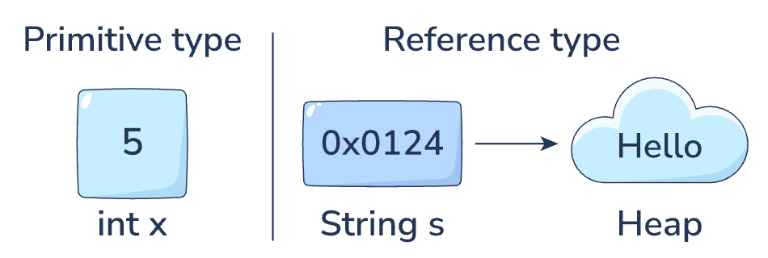

Java enforces a strict rule: every variable we declare must be either a primitive type or a reference type.
8 primitive types.

Primitive types: These are the atoms of Java. They represent simple values like a number (20) or a character ('A'). When we create a primitive variable, we are creating a container that holds the value directly.

Reference types: These handle complex data, such as strings, arrays, or custom objects. When we create a reference variable, it does not store the data itself. Instead, it stores a reference to the memory location where the data resides.

Ex : String greeting = "Hello Java";

Java stores the text "Hello Java" in the Heap (the large memory pool). Java creates the variable greeting on the Stack. It does not put the text inside greeting. Instead, it puts the address of the text inside greeting.

naming convention of variable : lowerCamelCase

## Memory management in java -> stack and heap
Stack: This is where method executions happen. When we run main, a block of memory (a “stack frame”) is created. Local variables—whether they are primitives or references—live here. The stack is fast, temporary, and organized.

Heap: This is a large, unstructured pool of memory used for storing objects. The heap is where the actual data for String, Point, or any other object lives.

When we run the code Point p1 = new Point(10, 20);\
-The Point object (with x=10, y=20) is created on the heap.\
-The p1 variable is created on the stack.\
-The p1 variable on the stack stores the address (e.g., 0xFA31) of the object on the heap.

When we run int population = 8000;\
-The variable population is created on the stack.\
-The value 8000 is stored directly inside population on the stack.

## Assignment behavior: Copying vs. aliasing
The difference between primitives and references becomes critical when we assign one variable to another using the = operator.

### Primitive assignment: Copying values
When we assign one primitive to another, Java copies the bits from the source variable into the destination variable. Since the variable holds the value, we get a completely independent copy.

### Reference assignment: Aliasing
When we assign one reference variable to another, we are copying the address, not the data.
This creates aliasing: two variables that point to the exact same object. If we modify the object using one variable, the other variable “sees” the change immediately.\
Java is always pass-by-value: when you pass an object to a method, Java copies the reference value, so both variables can refer to the same object.
 
        // Create a modifiable string containing "Start"
        StringBuilder ref1 = new StringBuilder("Start");

        // Copy the address from ref1 to ref2
        StringBuilder ref2 = ref1;
        
        // Change the text using ref2
        ref2.append("+End");
        
        // ref1 sees the change because it points to the same object
        System.out.println("ref1: " + ref1); 

NOTE : If a reference is null, it is not “zero” or “empty text.” It specifically means: this variable points to nothing. We cannot use it to access data or call methods. \
NULL : It is compatible with only reference type (classes, arrays, interfaces)
        // String message = null; // message holds no address
        // System.out.println(message.length()); // RUNTIME ERROR

Understanding null is vital because NullPointerException is the most common runtime error in Java. It simply means we tried to use a reference that wasn’t pointing to an object.

## Strings
Q. why its a reference type and not a primitive type?\
A. Because strings can be very long and complex, they are stored in the heap as objects

Q. Why its called literal ? vs other ways to create string?\
A. 🔹 1. String as a literal ✅
 > String s1 = "Hello";\

 •	"Hello" is a string literal\
 •	Stored in the String Pool\
 •	Reused if same value exists.

🔹 2. String using new keyword ❗
> String s2 = new String("Hello");\

•	This creates a new object in heap memory\
•	Even if "Hello" exists in pool, a new object is created\

🔹 3. String from expressions
> String s3 = "Hel" + "lo";\
> 
Compiler may optimize this to a literal\

Q.String s1 = "Hello";\
String s2 = "World";\
s1 = s2;\
A. There are two objects on the Heap. Both s1 and s2 point to “World”.

## Tye casting

### 1. Implicit casting (widening conversion)#

Common widening conversions include:

byte → short → int → long → float → double \
char → int → long → float → double

### Character arithmetic
A powerful application of integer promotion involves the char type. Since characters are stored as integer Unicode values (e.g., 'A' is 65), we can perform math on them.

       //'A' is promoted to int (65). Result is 66.
        int code = letter + 1;

        // We cast 66 back to char to get 'B'
        char nextLetter = (char) (letter + 1); 

### Explicit casting (narrowing conversion)
When we move data from a larger type to a smaller type, or from a floating-point type to an integer type, data loss is possible. The target container might not be big enough to hold the value, or it might not support decimal points.
Java refuses to do this automatically. We must certify that we accept the risk using explicit casting. We do this by placing the target type in parentheses (type) immediately before the value we want to convert.

        // Explicitly casts double to int
        // We accept the loss of decimal precision
        int truncatedValue = (int) preciseValue; 

        System.out.println("Original double: " + preciseValue);
        System.out.println("Casted int: " + truncatedValue);

### Data loss and overflow
When we perform a narrowing cast, we need to understand exactly how the data changes.

Truncation (floating-point to integer): Java does not round numbers when casting from double or float to integers. It truncates them, meaning it simply chops off the decimal part. 9.99 becomes 9, not 10.

Overflow (integer to integer): If an integer value is outside the range of the target type, the bits are truncated to fit. This often results in wrapping around to a negative number, a phenomenon known as overflow or underflow.

## Wrapper classes : 
Java provides wrapper classes, which allow us to treat primitive values as full-fledged objects\

For every primitive type in Java, there is a corresponding class in the java.lang package. These classes wrap primitive values in an object.\

    Prmitive class => byte -> Byte | long -> Long | and so on

Using a wrapper class is necessary when we need to distinguish between a valid default value (like 0) and no value (null). For example, in a banking app, an account balance of 0 is very different from a null balance (which might imply the account data hasn’t loaded yet).

Since Java 9, the constructors for these classes (e.g., new Integer(5)) have been deprecated. Instead, we use static factory methods like valueOf(). These methods are more efficient because they can reuse commonly used objects rather than creating new ones every time.
