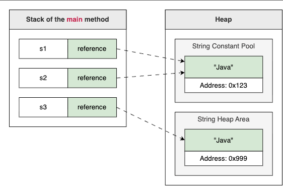

String is a reference type, meaning it is an object. However, because strings are so common, 
Java provides a special shorthand syntax for creating them.

### The String object and creation
1. String literal: We enclose text in double quotes ("Hello"). Java optimizes this by storing the string in a special memory area called the String Pool. If we use the same literal twice, Java reuses the existing instance to save memory.
2. new keyword: We can explicitly create a new object using new String("Hello"). This forces Java to create a distinct object on the heap, bypassing the pool’s optimization. We rarely do this in practice, but understanding the difference is vital for debugging.

        // Method 1: String Literal (Recommended)
        // Stored in the String Pool
        String s1 = "Java"; 
        String s2 = "Java"; // Reuses the same object as s1

        // Method 2: Using 'new' (Avoid unless necessary)
        // Forces a new object on the Heap, outside the Pool
        String s3 = new String("Java"); 

        // Comparing references (addresses), NOT content
        System.out.println("s1 == s2: " + (s1 == s2)); // true (Same pool object)
        System.out.println("s1 == s3: " + (s1 == s3)); // false (Different objects)

#### Immutability of sting : 
Once a String object is created, its internal state (the sequence of characters) cannot be changed.

When we appear to modify a string, such as by adding text to it, Java does not change the original object. Instead, it creates a new String object containing the result and updates our variable to point to this new object.
        
        String greeting = "Hello";
        // We attempt to modify the string
        greeting.concat(", World"); 
        System.out.println("After concat (ignored): " + greeting);

        // We must reassign the variable to store the change
        greeting = greeting.concat(", World"); 
        System.out.println("After reassignment: " + greeting);

#### Concatenation and composition
1. \+ operator : The most common string operation is combining text, known as concatenation. We typically use the + operator. Java handles + smartly: if we add a non-string value (like a number) to a string, Java automatically converts the value to a string before combining them.

While + is convenient, remember that every concatenation creates a new string object.

+ operator vs concat : 
+ -> works on string and other types as well. Handles mixed data types automatically () used mostly
concat  -> only works with string. Cannot work with null.

2. formatting string :

        // Using String.format (Static method)
        String label = String.format("Item: %s | Price: $%.2f | Stock: %d", product, price, stock);

        // Using .formatted (Instance method - Java 15+)
        String modernLabel = "Item: %s | Price: $%.2f | Stock: %d".formatted(product, price, stock);

3. Comapring string :\
   == compares references: It checks if two variables point to the exact same memory address.

    .equals() compares content: It checks if two strings contain the same sequence of characters.

4. String methods : indexOf()  , substring(int beginIndex, int endIndex), trim()/strip(),
   endsWith("String") , isEmpty(), charAt(),

Arrays.toString() : Converts array elements into a formatted string,
Without it, printing an array directly shows memory reference instead of contents

**NOTE : substring(begin, end) method includes the character at the begin index but excludes the character at the end index** 

## StringBuilder/ StringBuffer : 
--Methods : append(),insert(index, value), delete(start, end), reverse(), deleteCharAt(index)

  We call toString() to convert the mutable sequence back into an immutable String 

#### StringBuilder :
StringBuilder is flexible; it can accept primitives, arrays, objects, and strings.

        // Initialize with a starting string
        StringBuilder message = new StringBuilder("Welcome");

        // Append different data types
        message.append(" to");      // Appends String
        message.append(' ');        // Appends char
        message.append("Java ");    // Appends String
        message.append(25);         // Appends int
        System.out.println("StringBuilder Result: " + builder.toString());

## Stringbuffer : 
Java provides another class called StringBuffer. It offers the exact same methods as StringBuilder (append, insert, delete, etc.), but with one critical difference: thread safety.
Methods in StringBuffer are synchronized. This means that if multiple threads try to modify a StringBuffer at the same time, Java ensures that only one thread can access it at a time, preventing data corruption.\
However, this safety comes with a performance cost. Synchronization requires extra processing overhead, making StringBuffer slower than StringBuilder.In modern Java development, we rarely use StringBuffer.

        // Usage is identical to StringBuilder
        StringBuffer safeBuffer = new StringBuffer("Thread-safe ");
        safeBuffer.append("sequence");
        System.out.println(safeBuffer);

Use String when the value is constant or rarely changes. This includes string literals, constants, identifiers, and map keys. Immutability makes it safe and easy to cache.

Use StringBuilder for almost all text manipulation. If you are building strings in a loop, formatting complex output, or modifying text within a method, this is the standard choice. It is fast and efficient.

## DateTime : 
Java provides the java.time API a powerful, standard library introduced in Java 8 that makes time handling logical, immutable, and thread-safe.

1. LocalDate

        // Get the current date from the system clock
        LocalDate today = LocalDate.now();
        // Create a specific date: January 15, 2024
        LocalDate specificDate = LocalDate.of(2024, 1, 15);

2. LocalDateTime :
   A critical feature of the entire java.time API is immutability. Methods that seem to modify a date, like adding days or subtracting hours, do not change the original object. Instead, they return a new object with the calculated value. This prevents accidental side effects where changing a due date in one part of our code unexpectedly changes it elsewhere.
   // Current date and time
   LocalDateTime meetingStart = LocalDateTime.now();

        // Schedule a follow-up 3 days and 2 hours later
        // Note: We capture the *return value* because meetingStart does not change
        LocalDateTime followUp = meetingStart.plusDays(3).plusHours(2);
        
        System.out.println("Meeting Start: " + meetingStart);
        System.out.println("Follow Up:     " + followUp);
        
        // We can inspect specific fields
        System.out.println("Follow-up Month: " + followUp.getMonth());
        System.out.println("Follow-up Hour:  " + followUp.getHour());

To display dates in a specific format, we use the DateTimeFormatter class.

        LocalDateTime now = LocalDateTime.now();

        // Define a custom pattern
        DateTimeFormatter formatter = DateTimeFormatter.ofPattern("MM/dd/yyyy HH:mm");
        
        // Format the date object into a String
        String formattedDate = now.format(formatter);
        
        System.out.println("Original:  " + now);
        System.out.println("Formatted: " + formattedDate);

The reverse of formatting is parsing, converting a text string into a date object.

        String inputDate = "25-09-2024";
        
        // Create a formatter that matches the input string exactly
        DateTimeFormatter formatter = DateTimeFormatter.ofPattern("dd-MM-yyyy");
        
        // Parse the string into a LocalDate
        // If the format doesn't match, the program will stop with an error here
        LocalDate date = LocalDate.parse(inputDate, formatter);
        
        System.out.println("Parsed Date: " + date);
        System.out.println("Added 1 Week: " + date.plusWeeks(1));

## Array and its methods : 
1. Arrays.toString() only prints the memory references of the inner arrays. For nested arrays, we must use Arrays.deepToString(), which recursively formats every layer of data.

        // A simple 1D array
        int[] numbers = {1, 2, 3};
        
        // A 2D array (matrix)
        String[][] matrix = {
            {"A", "B"},
            {"C", "D"}
        };

        // 1. Trying to print directly (Unhelpful output)
        System.out.println("Direct Print: " + numbers);

        // 2. Using Arrays.toString() for 1D arrays
        System.out.println("Arrays.toString: " + Arrays.toString(numbers));

        // 3. Using Arrays.deepToString() for 2D arrays
        System.out.println("Arrays.deepToString: " + Arrays.deepToString(matrix));

2. we use Arrays.fill(). This method assigns the specified value to every element in the array instantly.
        
        // Fill the entire array with -1 (representing "no score yet")
        Arrays.fill(scores, -1);
3. Arrays.sort() . It is important to remember that this method is destructive: it modifies the original array directly rather than returning a new sorted copy

4. Searching : \
    a. Once an array is sorted, we can use **Arrays.binarySearch()** 

## Strings and Arrays Together 
Explore how to manipulate Java strings by converting them into character arrays for flexible editing.
By converting a string into a flexible array, we can modify data freely using standard loops and indexing. Mastering this workflow allows us to parse complex inputs, sanitize user data, and handle text processing tasks that neither structure can accomplish alone.

usecase :
When we need to analyze every character in a string individually
working with a char[] is often more natural than calling charAt() repeatedly

> The toCharArray() method creates a new character array containing every character from the original string
>> Ex : char[] characters = data.toCharArray();

### Modifying text in string : 
Since String objects are immutable, we cannot change a character at a specific index. If we need to modify text, such as masking sensitive information, we must first convert it to a mutable char[].
apply our changes to the array, and then construct a brand-new String from that array.

The String class provides a constructor new String(char[]) for reconstructing string from char array.

        String secret = "password123";
        char[] chars = secret.toCharArray();

        // Mask all characters except the first two
        for (int i = 2; i < chars.length; i++) {
            chars[i] = '*';
        }

        String masked = new String(chars);****

### Split string into two substrings :

        String csvRow = "Alice,Engineer,New York";
        
        // Split by comma
        String[] parts = csvRow.split(",");**

### join array of strings : 
String.join() takes a delimiter and an array (or sequence) of strings

        String[] words = {"Java", "is", "robust"};

        // Join with a space
        String sentence = String.join(" ", words);
        
        // Join with a hyphen
        String slug = String.join("-", words);

### Generating random numbers 
To generate random numbers in Java, we use the Random class from the java.util
The most commonly used method is nextInt(int bound)

## Extracting random characters from strings
We apply the exact same random-index logic to String objects.
This is the foundational technique for building features like randomized passwords or one-time passwords (**OTPs**) for two-factor authentication.
        
        String validChars = "ABCDEFGHIJKLMNOPQRSTUVWXYZ0123456789";
        StringBuilder password = new StringBuilder();
        Random random = new Random();

        for (int i = 0; i < 6; i++) {
            int randomIndex = random.nextInt(validChars.length());
            char randomChar = validChars.charAt(randomIndex);
            password.append(randomChar);
        }

        System.out.println("Generated code: " + password.toString());

## Shuffling array data : 
        int[] numbers = {1, 2, 3, 4, 5};
        Random random = new Random();

        for (int i = 0; i < numbers.length; i++) {
            int randomIndex = random.nextInt(numbers.length);
            
            // Swap the current element with the random element
            int temp = numbers[i];
            numbers[i] = numbers[randomIndex];
            numbers[randomIndex] = temp;
        }

        System.out.println("Shuffled array: " + Arrays.toString(numbers));

