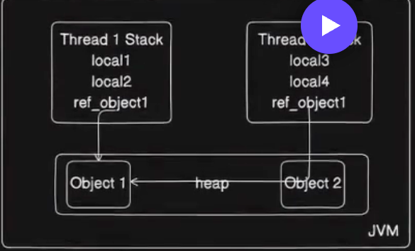

JMM model :
Thread stack - stores local variables and method calls of a thread.





how java memory model works in multithreading
In Java, the memory model defines how threads in a Java program interact through memory and how changes made by one thread are visible to others.
Understanding the Java Memory Model (JMM) is crucial for writing correct and efficient multithreaded applications.
Key Concepts of Java Memory Model:
1. **Threads and Shared Memory**:
   - In Java, each thread has its own stack memory for local variables, but all threads share the heap memory where objects are stored. This shared memory allows threads to communicate by reading and writing to shared objects.
2. **Visibility**:
    - Changes made by one thread to shared variables may not be immediately visible to other threads.
    - The JMM defines rules for when changes to variables made by one thread become visible to other threads.
3. **Happens-Before Relationship**:
   - The JMM defines a "happens-before" relationship that establishes a partial ordering of operations. If one action "happens-before" another, then the first is visible to and ordered before the second.
   - Examples of happens-before relationships include:
     - A write to a variable by one thread happens-before a subsequent read of that variable by another thread if proper synchronization is used.
     - The release of a lock happens-before the acquisition of the same lock by another thread.
4. **Synchronization**:
   - Synchronization mechanisms (like synchronized blocks, locks, and volatile variables) are used to ensure visibility and ordering of operations between threads.
   - Using synchronized blocks or methods ensures that only one thread can access a block of code at a time, providing mutual exclusion.
   - The volatile keyword ensures that reads and writes to a variable are directly from and to the main memory, making changes visible to all threads.
5. **Atomicity**:
   - Atomic operations are indivisible and uninterruptible. For example, reading or writing a single variable is atomic, but compound actions (like incrementing a variable) are not atomic unless properly synchronized.
6. **Reordering**:
   - The JMM allows the compiler and processor to reorder instructions for optimization purposes. However, this can lead to unexpected behavior in multithreaded programs if not properly synchronized.
Best Practices for Multithreading in Java:
- Always use synchronization mechanisms when accessing shared mutable data.
- Prefer using higher-level concurrency utilities from the `java.util.concurrent` package, such as `ConcurrentHashMap`, `AtomicInteger`, and `Locks`.
- Minimize the scope of synchronized blocks to reduce contention and improve performance.
- Use immutable objects whenever possible, as they are inherently thread-safe.
- Be cautious with the use of volatile variables; they are not a substitute for proper synchronization in complex operations.
By understanding and applying the principles of the Java Memory Model, developers can create robust and efficient multithreaded applications that behave correctly under concurrent access.
Example Code Demonstrating Shared Memory in Multithreading:
```javaclass SharedMemoryExample {
    private int sharedCounter = 0;
    private final Object lock = new Object();
