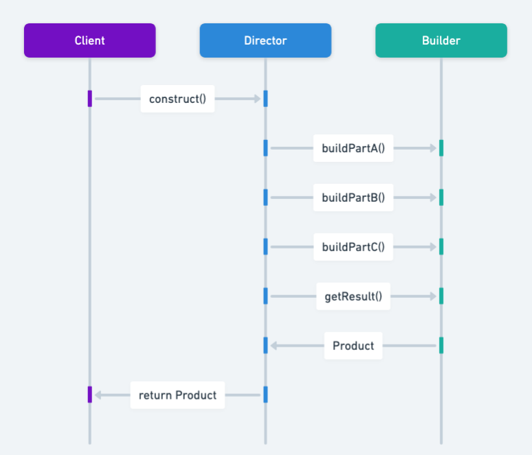

The Builder design pattern in Java, a fundamental creational pattern, allows for the step-by-step construction of complex objects.
It separates the construction of a complex object from its representation so that the same construction process can create different representations.

The Java Builder pattern is particularly useful in scenarios where object creation involves numerous parameters.

Allows you to create different flavors of an object while avoiding constructor pollution. Useful when there could be several flavors of an object. Or when there are a lot of steps involved in creation of an objec

The builder pattern is an object creation software design pattern with the intentions of finding a solution to the telescoping constructor antipattern.

With that in mind, let's explain what the telescoping constructor antipattern is. At some point, we have all encountered a constructor like the one below:

public Hero(Profession profession,String name,HairType hairType,HairColor hairColor,Armor armor,Weapon weapon){
// Value assignments
}

As you can see, the number of constructor parameters can quickly become overwhelming, making it difficult to understand their arrangement. 
Additionally, this list of parameters might continue to grow if you decide to add more options in the future. This is known as the telescoping constructor antipattern.

https://java-design-patterns.com/patterns/builder/#intent-of-builder-design-pattern

